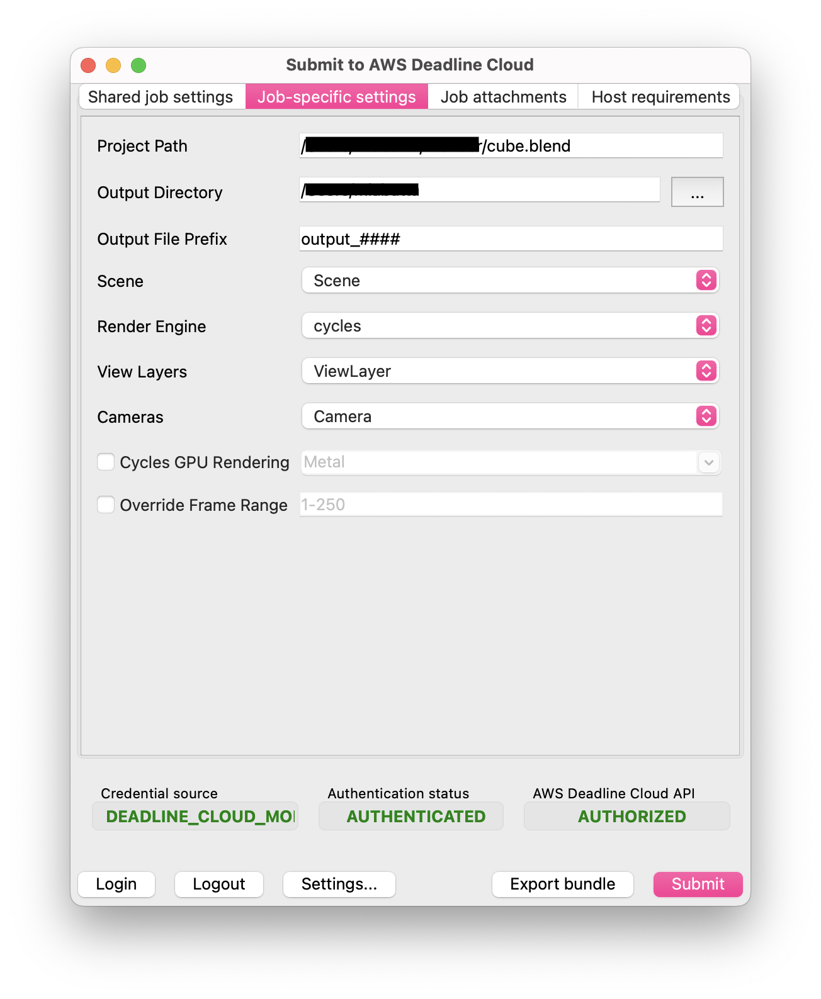

# Using the Deadline Cloud for Blender submitter

## Submit a job

**To submit a job from Blender to Deadline Cloud**

1. Save your Blender file.
1. In Blender's **Render** menu, choose **Submit to AWS Deadline Cloud**.
    - You may see a pop-up to install GUI dependencies. Choose **OK** and the submitter dialog will appear shortly.
1. Choose **Login** at the bottom of the dialog to log into your AWS profile.
1. Use the tabs in the dialog to customize your job.
1. (Optional) To export a job bundle to your job history directory without submitting it, choose **Export bundle**.
1. Choose **Submit** and follow the prompts to send your job to Deadline Cloud.

## Blender-specific Settings
The **Job-specific settings** tab has options specific to jobs created in Blender.

  - *Project Path* - The location where the current project is saved. Can't be changed.
  - *Output Directory* - The location to save file outputs from the render job.
  - *Output File Prefix* - The pattern to use when naming file outputs. Follows Blender's convention for file names.
  - *Scene* - The scene from the current project to render.
  - *Render Engine* - The render engine (Cycles, EEVEE, or Workbench) to use.
  - *View Layers* - The layer to render, or "All Renderable Layers" to render each applicable layer in the scene separately.
  - *Cameras* - The camera to render, or "All Renderable Cameras" to render each camera in the scene separately.
  - *Cycles GPU Rendering* - Select this to enable GPU rendering. Choose a device type supported by Blender or specify your own.
  - *Override Frame Range* - Select this to render a different frame or frame range than is specified in the scene file.

For information about the other submitter tabs, see the [AWS Deadline Cloud guide for using a submitter](https://docs.aws.amazon.com/deadline-cloud/latest/userguide/jobs-using-submitter.html).

## Monitoring your jobs

You can monitor job progress using the Deadline Cloud monitor. For more information, see the [AWS Deadline Cloud guide for using the monitor](https://docs.aws.amazon.com/deadline-cloud/latest/userguide/working-with-deadline-monitor.html).

## Getting help

- Contact AWS Support
- (Requires a GitHub account) [Open an issue in `deadline-cloud-for-blender` on GitHub](https://github.com/aws-deadline/deadline-cloud-for-blender/issues)